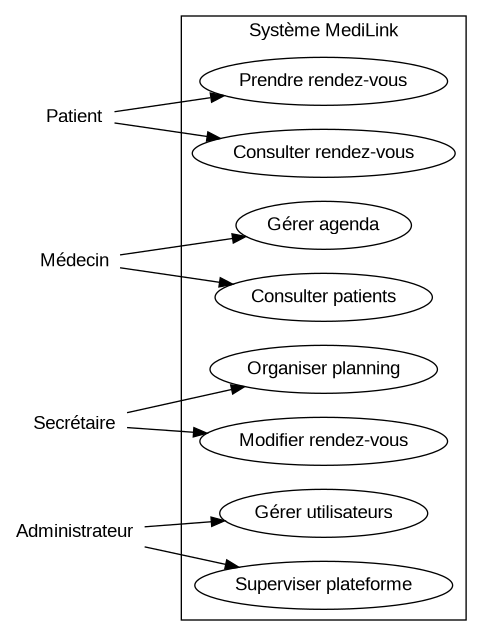
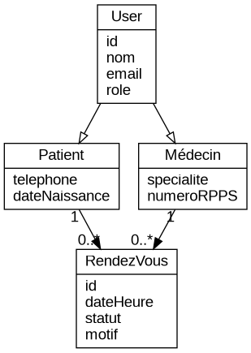
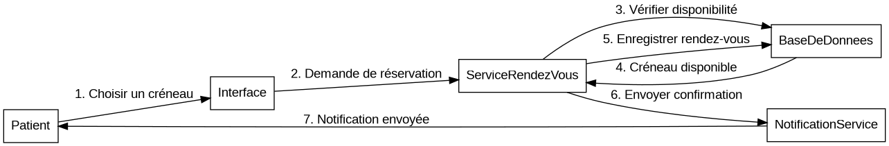

# MediLink - TP Conception d'application

## Présentation du projet

MediLink est une application web de gestion de rendez-vous médicaux destinée à faciliter la prise de rendez-vous entre les patients et les professionnels de santé.

L’objectif principal est de proposer une solution simple, claire et efficace permettant :
- aux patients de réserver un créneau en ligne,
- aux médecins de gérer leur agenda,
- aux secrétaires d’organiser les rendez-vous,
- aux administrateurs de superviser la plateforme.

Ce projet a été réalisé de manière individuelle dans le cadre d’un TP de conception d’application afin de mettre en pratique les notions de conception logicielle, d’architecture, de modélisation, de tests, de déploiement et de maintenance.

---

## 1. Objectif de l'application

L’application MediLink répond à plusieurs problématiques réelles :

- difficulté à joindre un cabinet médical par téléphone,
- perte de temps dans la gestion manuelle des rendez-vous,
- oublis de rendez-vous,
- manque de visibilité sur les créneaux disponibles,
- besoin de centraliser les informations liées aux rendez-vous.

L’objectif est donc d’améliorer l’organisation du parcours patient et la gestion du planning médical.

---

## 2. Fonctionnalités principales

### Côté patient
- création de compte,
- connexion sécurisée,
- recherche de médecins par spécialité,
- consultation des disponibilités,
- prise de rendez-vous,
- annulation ou modification d’un rendez-vous,
- réception de rappels et notifications,
- consultation de l’historique des rendez-vous.

### Côté médecin
- gestion des disponibilités,
- consultation de l’agenda,
- visualisation des rendez-vous du jour,
- accès à la liste des patients prévus,
- ajout de notes simples après consultation.

### Côté secrétaire
- gestion manuelle des rendez-vous,
- modification du planning,
- assistance aux patients,
- traitement des annulations.

### Côté administrateur
- gestion des utilisateurs,
- gestion des rôles,
- supervision générale de l’application,
- gestion des paramètres principaux.

---

## 3. Acteurs et parties prenantes

### Acteurs principaux
- Patient  
- Médecin  
- Secrétaire  
- Administrateur  

### Parties prenantes
- développeur (réalisation du projet),
- utilisateurs finaux (patients et professionnels de santé),
- hébergeur / administrateur système,
- structure médicale ou cabinet.

---

## 4. Démarche de conception

La conception de MediLink repose sur une approche modulaire afin de garantir une forte cohésion et un faible couplage entre les différentes parties du système.

Une architecture **monolithique modulaire** a été choisie afin de rester adaptée au contexte du projet. Ce choix permet :
- une meilleure lisibilité du code,
- une maintenance simplifiée,
- une bonne évolutivité,
- une meilleure organisation des responsabilités.

### Principes de conception appliqués
- **SRP (Single Responsibility Principle)** : chaque service a une responsabilité unique.
- **KISS** : le système reste simple et compréhensible.
- **YAGNI** : seules les fonctionnalités utiles sont implémentées.
- **DRY** : éviter la duplication de logique.

---

## 5. Architecture technique

Le projet est structuré en plusieurs modules :

- module d’authentification,
- module de gestion des utilisateurs,
- module de gestion des rendez-vous,
- module de notifications,
- module d’administration.

### Découpage technique
- **Frontend** : interface utilisateur (React)
- **Backend** : logique métier et API (Node.js / Express)
- **Base de données** : stockage des informations (MySQL / PostgreSQL)

Cette séparation permet de respecter les principes de conception et de faciliter les évolutions futures.

---

## 6. Technologies et outils

### Conception
- Figma (maquettes)
- Draw.io (diagrammes UML)

### Développement
- JavaScript
- React (frontend)
- Node.js / Express (backend)

### Base de données
- MySQL

### Gestion de projet
- Git / GitHub

### Tests
- tests unitaires et fonctionnels

### Sécurité
- utilisation du protocole HTTPS
- gestion des authentifications
- protection des données utilisateurs

---

## 7. Processus de création

### Conception
- analyse du besoin,
- identification des acteurs,
- définition des fonctionnalités,
- création des maquettes,
- modélisation UML,
- choix de l’architecture.

### Développement
- création de l’interface utilisateur,
- implémentation de l’API,
- création des modèles de données,
- mise en place des routes,
- séparation en controllers / services / models.

### Test
- tests unitaires,
- tests d’intégration,
- tests fonctionnels,
- validation du bon fonctionnement global.

### Déploiement
- configuration de l’environnement serveur,
- mise en ligne de l’application,
- sécurisation via HTTPS.

### Maintenance
- correction des bugs,
- amélioration des performances,
- ajout de nouvelles fonctionnalités,
- mises à jour de sécurité.

---

## 8. Schémas et diagrammes

Les diagrammes du projet sont disponibles dans le dossier `docs/diagrammes`.

Ils permettent de visualiser :
- les interactions entre les acteurs,
- la structure des données,
- le fonctionnement du système.

  
  

---

## 9. Choix et limites

Dans le cadre de ce projet, un choix volontaire de simplicité a été fait afin de rester cohérent avec un projet étudiant.

Certaines fonctionnalités avancées (comme la téléconsultation ou l’intégration avec des systèmes médicaux externes) n’ont pas été développées afin d’éviter une complexité inutile.

Ce choix respecte les principes **KISS** et **YAGNI**, en se concentrant sur les fonctionnalités essentielles.

---

## 10. Conclusion

MediLink est une application de prise de rendez-vous médicaux pensée pour être simple, utile et évolutive.

Ce projet illustre une démarche complète de conception logicielle, depuis l’analyse du besoin jusqu’à la maintenance, en passant par la modélisation, le développement, les tests et le déploiement.

Il met également en évidence l’importance d’une bonne conception avant toute implémentation technique.